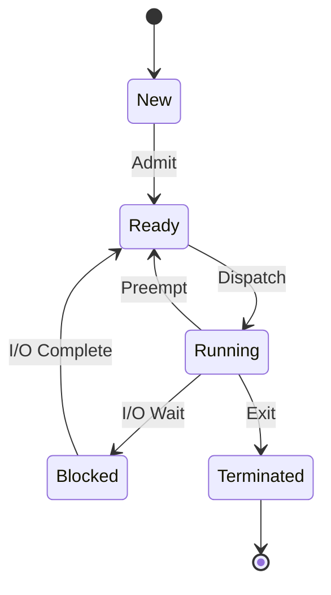
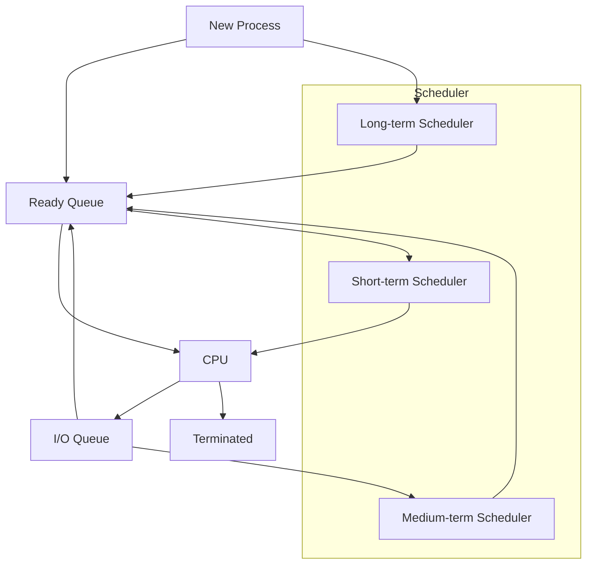
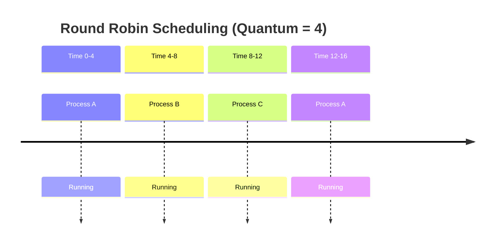

# ⏰ **Process Scheduling**

## 📘 **Theory**

Process scheduling is a fundamental concept in operating systems that determines which process gets CPU time and when. It's responsible for managing the execution of multiple processes, ensuring fair resource allocation, and optimizing system performance.

### **Why Process Scheduling Matters**
- **CPU Utilization**: Maximize CPU usage by keeping it busy
- **Throughput**: Increase number of processes completed per unit time
- **Response Time**: Minimize time between request and response
- **Turnaround Time**: Reduce total time from process submission to completion
- **Fairness**: Ensure all processes get fair access to CPU
- **System Stability**: Prevent system crashes and deadlocks

### **Key Concepts**
1. **Process States**: Ready, Running, Blocked, Terminated
2. **Scheduling Algorithms**: FCFS, SJF, Priority, Round Robin, etc.
3. **Context Switching**: Saving and restoring process state
4. **Preemption**: Interrupting a running process
5. **Quantum**: Time slice allocated to each process
6. **Scheduler**: Component responsible for process selection
7. **Dispatcher**: Component that performs context switching

### **Common Pitfalls and Best Practices**
- **Starvation**: Prevent processes from waiting indefinitely
- **Priority Inversion**: Handle priority conflicts properly
- **Context Switch Overhead**: Minimize switching costs
- **Load Balancing**: Distribute processes across multiple CPUs
- **Real-time Requirements**: Meet timing constraints for real-time systems
- **Energy Efficiency**: Optimize for power consumption

## 📊 **Diagrams**

### **Process State Transition**


### **Scheduling Queue Structure**


### **Round Robin Scheduling**


## 🧩 **Example**

**Scenario**: Implement a process scheduler with multiple scheduling algorithms

**Input**: List of processes with arrival time, burst time, and priority
**Expected Output**: Process execution order and performance metrics

**Step-by-step**:
1. Create process structures with required attributes
2. Implement different scheduling algorithms
3. Simulate process execution
4. Calculate performance metrics
5. Compare algorithm performance

## 💻 **Implementation (Golang)**

```go
package main

import (
    "fmt"
    "math"
    "sort"
    "time"
)

// Process represents a process in the system
type Process struct {
    ID           int
    ArrivalTime  int
    BurstTime    int
    Priority     int
    StartTime    int
    EndTime      int
    WaitingTime  int
    TurnaroundTime int
    ResponseTime int
    RemainingTime int
    FirstRun     bool
}

// Scheduler interface for different scheduling algorithms
type Scheduler interface {
    Schedule(processes []Process) []Process
    GetName() string
}

// FCFS (First Come First Served) Scheduler
type FCFSScheduler struct{}

func (f *FCFSScheduler) GetName() string {
    return "First Come First Served (FCFS)"
}

func (f *FCFSScheduler) Schedule(processes []Process) []Process {
    // Sort by arrival time
    sorted := make([]Process, len(processes))
    copy(sorted, processes)
    sort.Slice(sorted, func(i, j int) bool {
        return sorted[i].ArrivalTime < sorted[j].ArrivalTime
    })

    currentTime := 0
    for i := range sorted {
        if sorted[i].ArrivalTime > currentTime {
            currentTime = sorted[i].ArrivalTime
        }
        
        sorted[i].StartTime = currentTime
        sorted[i].EndTime = currentTime + sorted[i].BurstTime
        sorted[i].WaitingTime = sorted[i].StartTime - sorted[i].ArrivalTime
        sorted[i].TurnaroundTime = sorted[i].EndTime - sorted[i].ArrivalTime
        sorted[i].ResponseTime = sorted[i].StartTime - sorted[i].ArrivalTime
        
        currentTime = sorted[i].EndTime
    }

    return sorted
}

// SJF (Shortest Job First) Scheduler
type SJFScheduler struct{}

func (s *SJFScheduler) GetName() string {
    return "Shortest Job First (SJF)"
}

func (s *SJFScheduler) Schedule(processes []Process) []Process {
    sorted := make([]Process, len(processes))
    copy(sorted, processes)
    
    currentTime := 0
    completed := 0
    n := len(sorted)
    
    for completed < n {
        // Find processes that have arrived
        var ready []Process
        for i := range sorted {
            if sorted[i].ArrivalTime <= currentTime && sorted[i].StartTime == 0 {
                ready = append(ready, sorted[i])
            }
        }
        
        if len(ready) == 0 {
            currentTime++
            continue
        }
        
        // Find shortest job
        shortest := 0
        for i := 1; i < len(ready); i++ {
            if ready[i].BurstTime < ready[shortest].BurstTime {
                shortest = i
            }
        }
        
        // Execute shortest job
        for i := range sorted {
            if sorted[i].ID == ready[shortest].ID {
                sorted[i].StartTime = currentTime
                sorted[i].EndTime = currentTime + sorted[i].BurstTime
                sorted[i].WaitingTime = sorted[i].StartTime - sorted[i].ArrivalTime
                sorted[i].TurnaroundTime = sorted[i].EndTime - sorted[i].ArrivalTime
                sorted[i].ResponseTime = sorted[i].StartTime - sorted[i].ArrivalTime
                currentTime = sorted[i].EndTime
                completed++
                break
            }
        }
    }

    return sorted
}

// Priority Scheduler
type PriorityScheduler struct{}

func (p *PriorityScheduler) GetName() string {
    return "Priority Scheduling"
}

func (p *PriorityScheduler) Schedule(processes []Process) []Process {
    sorted := make([]Process, len(processes))
    copy(sorted, processes)
    
    currentTime := 0
    completed := 0
    n := len(sorted)
    
    for completed < n {
        // Find processes that have arrived
        var ready []Process
        for i := range sorted {
            if sorted[i].ArrivalTime <= currentTime && sorted[i].StartTime == 0 {
                ready = append(ready, sorted[i])
            }
        }
        
        if len(ready) == 0 {
            currentTime++
            continue
        }
        
        // Find highest priority (lowest number)
        highest := 0
        for i := 1; i < len(ready); i++ {
            if ready[i].Priority < ready[highest].Priority {
                highest = i
            }
        }
        
        // Execute highest priority job
        for i := range sorted {
            if sorted[i].ID == ready[highest].ID {
                sorted[i].StartTime = currentTime
                sorted[i].EndTime = currentTime + sorted[i].BurstTime
                sorted[i].WaitingTime = sorted[i].StartTime - sorted[i].ArrivalTime
                sorted[i].TurnaroundTime = sorted[i].EndTime - sorted[i].ArrivalTime
                sorted[i].ResponseTime = sorted[i].StartTime - sorted[i].ArrivalTime
                currentTime = sorted[i].EndTime
                completed++
                break
            }
        }
    }

    return sorted
}

// Round Robin Scheduler
type RoundRobinScheduler struct {
    Quantum int
}

func (r *RoundRobinScheduler) GetName() string {
    return fmt.Sprintf("Round Robin (Quantum: %d)", r.Quantum)
}

func (r *RoundRobinScheduler) Schedule(processes []Process) []Process {
    sorted := make([]Process, len(processes))
    copy(sorted, processes)
    
    // Initialize remaining time
    for i := range sorted {
        sorted[i].RemainingTime = sorted[i].BurstTime
        sorted[i].FirstRun = true
    }
    
    // Sort by arrival time
    sort.Slice(sorted, func(i, j int) bool {
        return sorted[i].ArrivalTime < sorted[j].ArrivalTime
    })
    
    currentTime := 0
    completed := 0
    n := len(sorted)
    queue := make([]int, 0)
    queueIndex := 0
    
    // Add first process to queue
    if n > 0 {
        queue = append(queue, 0)
    }
    
    for completed < n {
        if len(queue) == 0 {
            currentTime++
            // Add new processes that have arrived
            for i := range sorted {
                if sorted[i].ArrivalTime == currentTime && sorted[i].RemainingTime > 0 {
                    queue = append(queue, i)
                }
            }
            continue
        }
        
        // Get next process from queue
        processIndex := queue[queueIndex]
        process := &sorted[processIndex]
        
        // Set start time on first run
        if process.FirstRun {
            process.StartTime = currentTime
            process.FirstRun = false
        }
        
        // Execute for quantum or remaining time
        executionTime := r.Quantum
        if process.RemainingTime < r.Quantum {
            executionTime = process.RemainingTime
        }
        
        process.RemainingTime -= executionTime
        currentTime += executionTime
        
        // Add new processes that have arrived
        for i := range sorted {
            if sorted[i].ArrivalTime <= currentTime && sorted[i].RemainingTime > 0 {
                // Check if already in queue
                inQueue := false
                for _, qIndex := range queue {
                    if qIndex == i {
                        inQueue = true
                        break
                    }
                }
                if !inQueue {
                    queue = append(queue, i)
                }
            }
        }
        
        // If process completed
        if process.RemainingTime == 0 {
            process.EndTime = currentTime
            process.WaitingTime = process.EndTime - process.ArrivalTime - process.BurstTime
            process.TurnaroundTime = process.EndTime - process.ArrivalTime
            process.ResponseTime = process.StartTime - process.ArrivalTime
            completed++
            
            // Remove from queue
            queue = append(queue[:queueIndex], queue[queueIndex+1:]...)
            if queueIndex >= len(queue) {
                queueIndex = 0
            }
        } else {
            // Move to next process in queue
            queueIndex = (queueIndex + 1) % len(queue)
        }
    }

    return sorted
}

// Multilevel Queue Scheduler
type MultilevelQueueScheduler struct {
    Queues [][]Process
    Quantum int
}

func (m *MultilevelQueueScheduler) GetName() string {
    return "Multilevel Queue Scheduling"
}

func (m *MultilevelQueueScheduler) Schedule(processes []Process) []Process {
    // Separate processes by priority
    highPriority := make([]Process, 0)
    lowPriority := make([]Process, 0)
    
    for _, p := range processes {
        if p.Priority <= 2 {
            highPriority = append(highPriority, p)
        } else {
            lowPriority = append(lowPriority, p)
        }
    }
    
    // Schedule high priority with FCFS
    fcfs := &FCFSScheduler{}
    highPriority = fcfs.Schedule(highPriority)
    
    // Schedule low priority with Round Robin
    rr := &RoundRobinScheduler{Quantum: m.Quantum}
    lowPriority = rr.Schedule(lowPriority)
    
    // Combine results
    result := append(highPriority, lowPriority...)
    return result
}

// SRTF (Shortest Remaining Time First) Scheduler
type SRTFScheduler struct{}

func (s *SRTFScheduler) GetName() string {
    return "Shortest Remaining Time First (SRTF)"
}

func (s *SRTFScheduler) Schedule(processes []Process) []Process {
    sorted := make([]Process, len(processes))
    copy(sorted, processes)
    
    // Initialize remaining time
    for i := range sorted {
        sorted[i].RemainingTime = sorted[i].BurstTime
        sorted[i].FirstRun = true
    }
    
    currentTime := 0
    completed := 0
    n := len(sorted)
    
    for completed < n {
        // Find processes that have arrived and not completed
        var ready []Process
        for i := range sorted {
            if sorted[i].ArrivalTime <= currentTime && sorted[i].RemainingTime > 0 {
                ready = append(ready, sorted[i])
            }
        }
        
        if len(ready) == 0 {
            currentTime++
            continue
        }
        
        // Find shortest remaining time
        shortest := 0
        for i := 1; i < len(ready); i++ {
            if ready[i].RemainingTime < ready[shortest].RemainingTime {
                shortest = i
            }
        }
        
        // Execute shortest remaining time job
        for i := range sorted {
            if sorted[i].ID == ready[shortest].ID {
                if sorted[i].FirstRun {
                    sorted[i].StartTime = currentTime
                    sorted[i].FirstRun = false
                }
                
                sorted[i].RemainingTime--
                currentTime++
                
                if sorted[i].RemainingTime == 0 {
                    sorted[i].EndTime = currentTime
                    sorted[i].WaitingTime = sorted[i].EndTime - sorted[i].ArrivalTime - sorted[i].BurstTime
                    sorted[i].TurnaroundTime = sorted[i].EndTime - sorted[i].ArrivalTime
                    sorted[i].ResponseTime = sorted[i].StartTime - sorted[i].ArrivalTime
                    completed++
                }
                break
            }
        }
    }

    return sorted
}

// Performance metrics calculator
type PerformanceMetrics struct {
    AverageWaitingTime   float64
    AverageTurnaroundTime float64
    AverageResponseTime  float64
    Throughput           float64
    CPUUtilization       float64
}

func CalculateMetrics(processes []Process, totalTime int) PerformanceMetrics {
    var totalWaiting, totalTurnaround, totalResponse float64
    n := float64(len(processes))
    
    for _, p := range processes {
        totalWaiting += float64(p.WaitingTime)
        totalTurnaround += float64(p.TurnaroundTime)
        totalResponse += float64(p.ResponseTime)
    }
    
    totalBurstTime := 0
    for _, p := range processes {
        totalBurstTime += p.BurstTime
    }
    
    return PerformanceMetrics{
        AverageWaitingTime:    totalWaiting / n,
        AverageTurnaroundTime: totalTurnaround / n,
        AverageResponseTime:   totalResponse / n,
        Throughput:           n / float64(totalTime),
        CPUUtilization:       float64(totalBurstTime) / float64(totalTime) * 100,
    }
}

// Scheduler simulator
type SchedulerSimulator struct {
    Schedulers []Scheduler
}

func NewSchedulerSimulator() *SchedulerSimulator {
    return &SchedulerSimulator{
        Schedulers: []Scheduler{
            &FCFSScheduler{},
            &SJFScheduler{},
            &PriorityScheduler{},
            &RoundRobinScheduler{Quantum: 4},
            &SRTFScheduler{},
            &MultilevelQueueScheduler{Quantum: 4},
        },
    }
}

func (s *SchedulerSimulator) Simulate(processes []Process) {
    fmt.Println("=== Process Scheduling Simulation ===")
    fmt.Printf("Number of processes: %d\n", len(processes))
    fmt.Println()
    
    for _, scheduler := range s.Schedulers {
        fmt.Printf("--- %s ---\n", scheduler.GetName())
        
        // Create a copy of processes for this scheduler
        testProcesses := make([]Process, len(processes))
        copy(testProcesses, processes)
        
        // Schedule processes
        result := scheduler.Schedule(testProcesses)
        
        // Calculate metrics
        maxTime := 0
        for _, p := range result {
            if p.EndTime > maxTime {
                maxTime = p.EndTime
            }
        }
        
        metrics := CalculateMetrics(result, maxTime)
        
        // Print results
        fmt.Printf("Process Execution Order:\n")
        for _, p := range result {
            fmt.Printf("P%d: Start=%d, End=%d, Waiting=%d, Turnaround=%d, Response=%d\n",
                p.ID, p.StartTime, p.EndTime, p.WaitingTime, p.TurnaroundTime, p.ResponseTime)
        }
        
        fmt.Printf("\nPerformance Metrics:\n")
        fmt.Printf("Average Waiting Time: %.2f\n", metrics.AverageWaitingTime)
        fmt.Printf("Average Turnaround Time: %.2f\n", metrics.AverageTurnaroundTime)
        fmt.Printf("Average Response Time: %.2f\n", metrics.AverageResponseTime)
        fmt.Printf("Throughput: %.2f processes/time unit\n", metrics.Throughput)
        fmt.Printf("CPU Utilization: %.2f%%\n", metrics.CPUUtilization)
        fmt.Println()
    }
}

// Example usage
func main() {
    // Create sample processes
    processes := []Process{
        {ID: 1, ArrivalTime: 0, BurstTime: 8, Priority: 3},
        {ID: 2, ArrivalTime: 1, BurstTime: 4, Priority: 1},
        {ID: 3, ArrivalTime: 2, BurstTime: 9, Priority: 2},
        {ID: 4, ArrivalTime: 3, BurstTime: 5, Priority: 4},
        {ID: 5, ArrivalTime: 4, BurstTime: 2, Priority: 1},
    }
    
    // Create simulator
    simulator := NewSchedulerSimulator()
    
    // Run simulation
    simulator.Simulate(processes)
    
    // Test with different process sets
    fmt.Println("=== Different Process Set ===")
    processes2 := []Process{
        {ID: 1, ArrivalTime: 0, BurstTime: 10, Priority: 1},
        {ID: 2, ArrivalTime: 1, BurstTime: 1, Priority: 2},
        {ID: 3, ArrivalTime: 2, BurstTime: 2, Priority: 3},
        {ID: 4, ArrivalTime: 3, BurstTime: 1, Priority: 4},
        {ID: 5, ArrivalTime: 4, BurstTime: 5, Priority: 5},
    }
    
    simulator.Simulate(processes2)
}
```

## 💻 **Implementation (Node.js)**

```javascript
// Process represents a process in the system
class Process {
  constructor(id, arrivalTime, burstTime, priority) {
    this.id = id;
    this.arrivalTime = arrivalTime;
    this.burstTime = burstTime;
    this.priority = priority;
    this.startTime = 0;
    this.endTime = 0;
    this.waitingTime = 0;
    this.turnaroundTime = 0;
    this.responseTime = 0;
    this.remainingTime = burstTime;
    this.firstRun = true;
  }
}

// Scheduler interface for different scheduling algorithms
class Scheduler {
  schedule(processes) {
    throw new Error('Method must be implemented');
  }
  
  getName() {
    throw new Error('Method must be implemented');
  }
}

// FCFS (First Come First Served) Scheduler
class FCFSScheduler extends Scheduler {
  getName() {
    return 'First Come First Served (FCFS)';
  }
  
  schedule(processes) {
    // Sort by arrival time
    const sorted = [...processes].sort((a, b) => a.arrivalTime - b.arrivalTime);
    
    let currentTime = 0;
    for (const process of sorted) {
      if (process.arrivalTime > currentTime) {
        currentTime = process.arrivalTime;
      }
      
      process.startTime = currentTime;
      process.endTime = currentTime + process.burstTime;
      process.waitingTime = process.startTime - process.arrivalTime;
      process.turnaroundTime = process.endTime - process.arrivalTime;
      process.responseTime = process.startTime - process.arrivalTime;
      
      currentTime = process.endTime;
    }
    
    return sorted;
  }
}

// SJF (Shortest Job First) Scheduler
class SJFScheduler extends Scheduler {
  getName() {
    return 'Shortest Job First (SJF)';
  }
  
  schedule(processes) {
    const sorted = [...processes];
    
    let currentTime = 0;
    let completed = 0;
    const n = sorted.length;
    
    while (completed < n) {
      // Find processes that have arrived
      const ready = sorted.filter(p => p.arrivalTime <= currentTime && p.startTime === 0);
      
      if (ready.length === 0) {
        currentTime++;
        continue;
      }
      
      // Find shortest job
      const shortest = ready.reduce((min, current) => 
        current.burstTime < min.burstTime ? current : min
      );
      
      // Execute shortest job
      const process = sorted.find(p => p.id === shortest.id);
      process.startTime = currentTime;
      process.endTime = currentTime + process.burstTime;
      process.waitingTime = process.startTime - process.arrivalTime;
      process.turnaroundTime = process.endTime - process.arrivalTime;
      process.responseTime = process.startTime - process.arrivalTime;
      currentTime = process.endTime;
      completed++;
    }
    
    return sorted;
  }
}

// Priority Scheduler
class PriorityScheduler extends Scheduler {
  getName() {
    return 'Priority Scheduling';
  }
  
  schedule(processes) {
    const sorted = [...processes];
    
    let currentTime = 0;
    let completed = 0;
    const n = sorted.length;
    
    while (completed < n) {
      // Find processes that have arrived
      const ready = sorted.filter(p => p.arrivalTime <= currentTime && p.startTime === 0);
      
      if (ready.length === 0) {
        currentTime++;
        continue;
      }
      
      // Find highest priority (lowest number)
      const highest = ready.reduce((min, current) => 
        current.priority < min.priority ? current : min
      );
      
      // Execute highest priority job
      const process = sorted.find(p => p.id === highest.id);
      process.startTime = currentTime;
      process.endTime = currentTime + process.burstTime;
      process.waitingTime = process.startTime - process.arrivalTime;
      process.turnaroundTime = process.endTime - process.arrivalTime;
      process.responseTime = process.startTime - process.arrivalTime;
      currentTime = process.endTime;
      completed++;
    }
    
    return sorted;
  }
}

// Round Robin Scheduler
class RoundRobinScheduler extends Scheduler {
  constructor(quantum = 4) {
    super();
    this.quantum = quantum;
  }
  
  getName() {
    return `Round Robin (Quantum: ${this.quantum})`;
  }
  
  schedule(processes) {
    const sorted = [...processes];
    
    // Initialize remaining time
    for (const process of sorted) {
      process.remainingTime = process.burstTime;
      process.firstRun = true;
    }
    
    // Sort by arrival time
    sorted.sort((a, b) => a.arrivalTime - b.arrivalTime);
    
    let currentTime = 0;
    let completed = 0;
    const n = sorted.length;
    let queue = [];
    let queueIndex = 0;
    
    // Add first process to queue
    if (n > 0) {
      queue.push(0);
    }
    
    while (completed < n) {
      if (queue.length === 0) {
        currentTime++;
        // Add new processes that have arrived
        for (let i = 0; i < sorted.length; i++) {
          if (sorted[i].arrivalTime === currentTime && sorted[i].remainingTime > 0) {
            if (!queue.includes(i)) {
              queue.push(i);
            }
          }
        }
        continue;
      }
      
      // Get next process from queue
      const processIndex = queue[queueIndex];
      const process = sorted[processIndex];
      
      // Set start time on first run
      if (process.firstRun) {
        process.startTime = currentTime;
        process.firstRun = false;
      }
      
      // Execute for quantum or remaining time
      const executionTime = Math.min(this.quantum, process.remainingTime);
      process.remainingTime -= executionTime;
      currentTime += executionTime;
      
      // Add new processes that have arrived
      for (let i = 0; i < sorted.length; i++) {
        if (sorted[i].arrivalTime <= currentTime && sorted[i].remainingTime > 0) {
          if (!queue.includes(i)) {
            queue.push(i);
          }
        }
      }
      
      // If process completed
      if (process.remainingTime === 0) {
        process.endTime = currentTime;
        process.waitingTime = process.endTime - process.arrivalTime - process.burstTime;
        process.turnaroundTime = process.endTime - process.arrivalTime;
        process.responseTime = process.startTime - process.arrivalTime;
        completed++;
        
        // Remove from queue
        queue.splice(queueIndex, 1);
        if (queueIndex >= queue.length) {
          queueIndex = 0;
        }
      } else {
        // Move to next process in queue
        queueIndex = (queueIndex + 1) % queue.length;
      }
    }
    
    return sorted;
  }
}

// SRTF (Shortest Remaining Time First) Scheduler
class SRTFScheduler extends Scheduler {
  getName() {
    return 'Shortest Remaining Time First (SRTF)';
  }
  
  schedule(processes) {
    const sorted = [...processes];
    
    // Initialize remaining time
    for (const process of sorted) {
      process.remainingTime = process.burstTime;
      process.firstRun = true;
    }
    
    let currentTime = 0;
    let completed = 0;
    const n = sorted.length;
    
    while (completed < n) {
      // Find processes that have arrived and not completed
      const ready = sorted.filter(p => p.arrivalTime <= currentTime && p.remainingTime > 0);
      
      if (ready.length === 0) {
        currentTime++;
        continue;
      }
      
      // Find shortest remaining time
      const shortest = ready.reduce((min, current) => 
        current.remainingTime < min.remainingTime ? current : min
      );
      
      // Execute shortest remaining time job
      const process = sorted.find(p => p.id === shortest.id);
      if (process.firstRun) {
        process.startTime = currentTime;
        process.firstRun = false;
      }
      
      process.remainingTime--;
      currentTime++;
      
      if (process.remainingTime === 0) {
        process.endTime = currentTime;
        process.waitingTime = process.endTime - process.arrivalTime - process.burstTime;
        process.turnaroundTime = process.endTime - process.arrivalTime;
        process.responseTime = process.startTime - process.arrivalTime;
        completed++;
      }
    }
    
    return sorted;
  }
}

// Performance metrics calculator
class PerformanceMetrics {
  constructor(processes, totalTime) {
    const n = processes.length;
    const totalWaiting = processes.reduce((sum, p) => sum + p.waitingTime, 0);
    const totalTurnaround = processes.reduce((sum, p) => sum + p.turnaroundTime, 0);
    const totalResponse = processes.reduce((sum, p) => sum + p.responseTime, 0);
    const totalBurstTime = processes.reduce((sum, p) => sum + p.burstTime, 0);
    
    this.averageWaitingTime = totalWaiting / n;
    this.averageTurnaroundTime = totalTurnaround / n;
    this.averageResponseTime = totalResponse / n;
    this.throughput = n / totalTime;
    this.cpuUtilization = (totalBurstTime / totalTime) * 100;
  }
}

// Scheduler simulator
class SchedulerSimulator {
  constructor() {
    this.schedulers = [
      new FCFSScheduler(),
      new SJFScheduler(),
      new PriorityScheduler(),
      new RoundRobinScheduler(4),
      new SRTFScheduler()
    ];
  }
  
  simulate(processes) {
    console.log('=== Process Scheduling Simulation ===');
    console.log(`Number of processes: ${processes.length}`);
    console.log();
    
    for (const scheduler of this.schedulers) {
      console.log(`--- ${scheduler.getName()} ---`);
      
      // Create a copy of processes for this scheduler
      const testProcesses = processes.map(p => new Process(p.id, p.arrivalTime, p.burstTime, p.priority));
      
      // Schedule processes
      const result = scheduler.schedule(testProcesses);
      
      // Calculate metrics
      const maxTime = Math.max(...result.map(p => p.endTime));
      const metrics = new PerformanceMetrics(result, maxTime);
      
      // Print results
      console.log('Process Execution Order:');
      for (const p of result) {
        console.log(`P${p.id}: Start=${p.startTime}, End=${p.endTime}, Waiting=${p.waitingTime}, Turnaround=${p.turnaroundTime}, Response=${p.responseTime}`);
      }
      
      console.log('\nPerformance Metrics:');
      console.log(`Average Waiting Time: ${metrics.averageWaitingTime.toFixed(2)}`);
      console.log(`Average Turnaround Time: ${metrics.averageTurnaroundTime.toFixed(2)}`);
      console.log(`Average Response Time: ${metrics.averageResponseTime.toFixed(2)}`);
      console.log(`Throughput: ${metrics.throughput.toFixed(2)} processes/time unit`);
      console.log(`CPU Utilization: ${metrics.cpuUtilization.toFixed(2)}%`);
      console.log();
    }
  }
}

// Example usage
function main() {
  // Create sample processes
  const processes = [
    new Process(1, 0, 8, 3),
    new Process(2, 1, 4, 1),
    new Process(3, 2, 9, 2),
    new Process(4, 3, 5, 4),
    new Process(5, 4, 2, 1)
  ];
  
  // Create simulator
  const simulator = new SchedulerSimulator();
  
  // Run simulation
  simulator.simulate(processes);
  
  // Test with different process sets
  console.log('=== Different Process Set ===');
  const processes2 = [
    new Process(1, 0, 10, 1),
    new Process(2, 1, 1, 2),
    new Process(3, 2, 2, 3),
    new Process(4, 3, 1, 4),
    new Process(5, 4, 5, 5)
  ];
  
  simulator.simulate(processes2);
}

// Run the example
main();
```

## ⏱ **Complexity Analysis**

### **Time Complexity**
- **FCFS**: O(n log n) for sorting
- **SJF**: O(n²) for finding shortest job
- **Priority**: O(n²) for finding highest priority
- **Round Robin**: O(n) for each time unit
- **SRTF**: O(n) for each time unit

### **Space Complexity**
- **All Algorithms**: O(n) for storing process information
- **Round Robin**: O(n) for queue management
- **SRTF**: O(n) for ready queue

## 🚀 **Optimal Solution**

The optimal process scheduling solution includes:

1. **Algorithm Selection**: Choose appropriate algorithm based on requirements
2. **Preemption**: Use preemptive algorithms for better response time
3. **Priority Handling**: Implement priority inheritance to prevent inversion
4. **Load Balancing**: Distribute processes across multiple CPUs
5. **Real-time Support**: Use real-time scheduling for time-critical tasks
6. **Energy Efficiency**: Optimize for power consumption

### **Production Considerations**
- Use appropriate scheduling algorithms for different workloads
- Implement proper priority handling and inheritance
- Consider real-time requirements and deadlines
- Use load balancing for multi-core systems
- Implement proper context switching optimization
- Monitor and tune scheduling parameters

## ❓ **Follow-up Questions**

### **How would this scale with X?**
- **Many Processes**: Use efficient data structures and algorithms
- **Multiple CPUs**: Use load balancing and affinity scheduling
- **Real-time Systems**: Use real-time scheduling algorithms

### **How can we optimize further if Y changes?**
- **Response Time**: Use preemptive algorithms and shorter quantums
- **Throughput**: Use non-preemptive algorithms and longer quantums
- **Fairness**: Use fair queuing and priority inheritance

### **What trade-offs exist in different approaches?**
- **Preemptive vs Non-preemptive**: Response time vs Overhead
- **Priority vs Fairness**: Performance vs Fairness
- **Quantum Size**: Response time vs Context switching overhead
