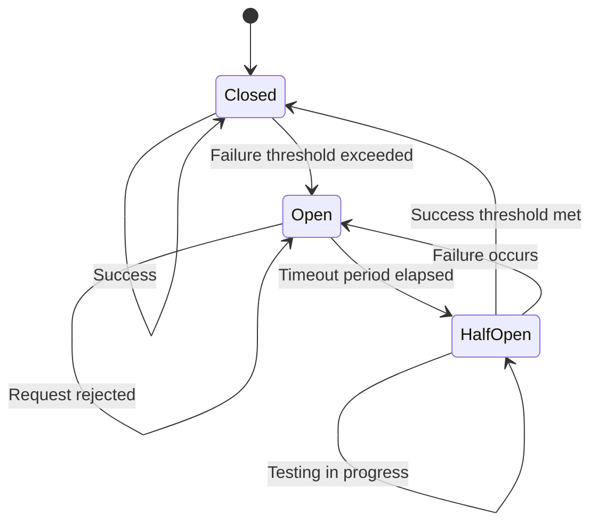
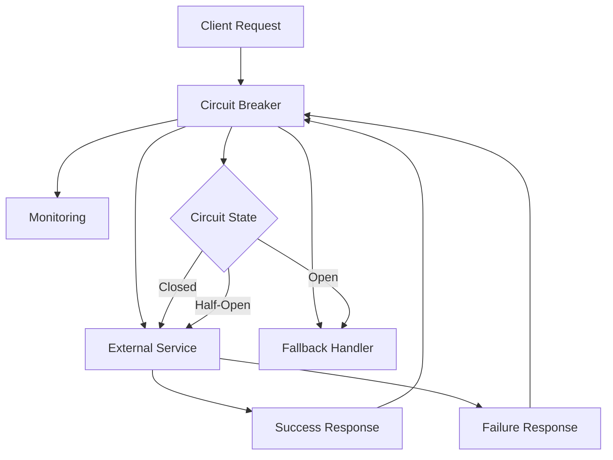
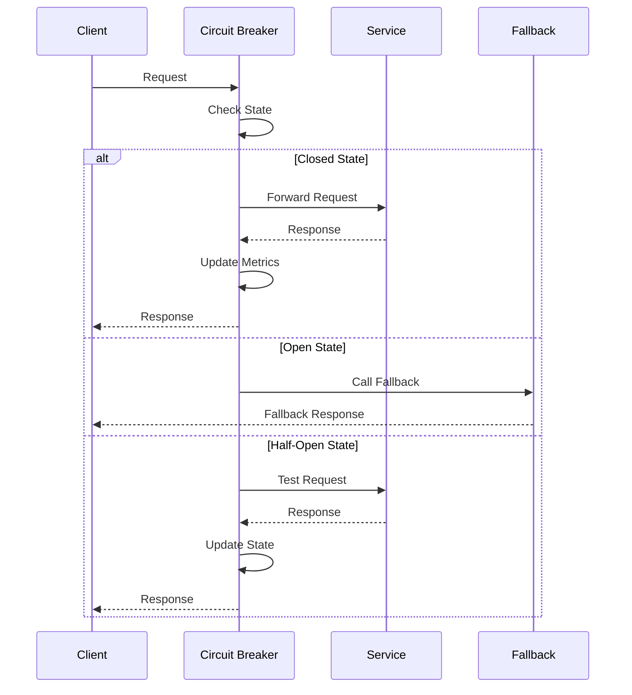

# ⚡ **Circuit Breaker Pattern**

## 📘 **Theory**

The Circuit Breaker pattern is a design pattern used to prevent cascading failures in distributed systems. It acts as a safety mechanism that monitors the health of external service calls and "opens" the circuit when failures exceed a threshold, preventing further calls to the failing service.

### **Why Circuit Breaker Matters**
- **Fault Tolerance**: Prevent cascading failures across services
- **Resource Protection**: Avoid overwhelming failing services
- **Fast Failure**: Quickly detect and respond to service degradation
- **System Stability**: Maintain overall system health during partial outages
- **Performance**: Reduce latency by failing fast instead of waiting for timeouts
- **Recovery**: Enable automatic recovery when services become healthy

### **Key Concepts**
1. **Closed State**: Normal operation, all requests pass through
2. **Open State**: Circuit is open, requests are immediately rejected
3. **Half-Open State**: Testing if the service has recovered
4. **Failure Threshold**: Number of failures before opening the circuit
5. **Timeout**: Duration to wait before attempting to close the circuit
6. **Success Threshold**: Number of successful calls to close the circuit
7. **Fallback**: Alternative behavior when circuit is open

### **Common Pitfalls and Best Practices**
- **Threshold Tuning**: Set appropriate failure thresholds based on service characteristics
- **Timeout Management**: Use reasonable timeouts for half-open state testing
- **Fallback Strategy**: Implement meaningful fallback mechanisms
- **Monitoring**: Track circuit breaker metrics and states
- **Configuration**: Make thresholds configurable for different environments
- **Testing**: Test circuit breaker behavior under various failure scenarios

## 📊 **Diagrams**

### **Circuit Breaker State Machine**


### **Circuit Breaker Architecture**


### **Failure Detection Flow**


## 🧩 **Example**

**Scenario**: Implement a circuit breaker for a payment service that fails frequently

**Input**: Payment requests with varying success/failure rates
**Expected Output**: Circuit breaker state changes and appropriate responses

**Step-by-step**:
1. Initialize circuit breaker with failure threshold of 5
2. Monitor service calls and track failures
3. Open circuit when threshold is exceeded
4. Wait for timeout period before testing recovery
5. Test service with limited requests in half-open state
6. Close circuit if service recovers, reopen if it fails

## 💻 **Implementation (Golang)**

```go
package main

import (
    "context"
    "fmt"
    "sync"
    "time"
)

// Circuit breaker states
type State int

const (
    StateClosed State = iota
    StateOpen
    StateHalfOpen
)

func (s State) String() string {
    switch s {
    case StateClosed:
        return "CLOSED"
    case StateOpen:
        return "OPEN"
    case StateHalfOpen:
        return "HALF_OPEN"
    default:
        return "UNKNOWN"
    }
}

// Circuit breaker configuration
type Config struct {
    FailureThreshold int           // Number of failures before opening
    SuccessThreshold int           // Number of successes to close from half-open
    Timeout          time.Duration // Time to wait before testing recovery
    MaxRequests      int           // Max requests in half-open state
}

// Circuit breaker metrics
type Metrics struct {
    TotalRequests    int64
    SuccessfulRequests int64
    FailedRequests   int64
    CircuitOpens     int64
    CircuitCloses    int64
    LastFailureTime  time.Time
    LastSuccessTime  time.Time
}

// Circuit breaker implementation
type CircuitBreaker struct {
    config     Config
    state      State
    metrics    Metrics
    failures   int
    successes  int
    mutex      sync.RWMutex
    lastFailTime time.Time
    halfOpenRequests int
}

// NewCircuitBreaker creates a new circuit breaker
func NewCircuitBreaker(config Config) *CircuitBreaker {
    return &CircuitBreaker{
        config: config,
        state:  StateClosed,
        metrics: Metrics{},
    }
}

// Execute runs a function through the circuit breaker
func (cb *CircuitBreaker) Execute(ctx context.Context, fn func() (interface{}, error)) (interface{}, error) {
    cb.mutex.Lock()
    defer cb.mutex.Unlock()

    cb.metrics.TotalRequests++

    // Check if circuit should be opened
    if cb.state == StateClosed && cb.failures >= cb.config.FailureThreshold {
        cb.openCircuit()
        return nil, fmt.Errorf("circuit breaker is open")
    }

    // Check if circuit is open
    if cb.state == StateOpen {
        if time.Since(cb.lastFailTime) < cb.config.Timeout {
            return nil, fmt.Errorf("circuit breaker is open")
        }
        cb.halfOpenCircuit()
    }

    // Check half-open state limits
    if cb.state == StateHalfOpen && cb.halfOpenRequests >= cb.config.MaxRequests {
        return nil, fmt.Errorf("circuit breaker half-open request limit exceeded")
    }

    // Execute the function
    if cb.state == StateHalfOpen {
        cb.halfOpenRequests++
    }

    result, err := fn()
    
    if err != nil {
        cb.recordFailure()
        return nil, err
    }

    cb.recordSuccess()
    return result, nil
}

// ExecuteWithFallback runs a function with fallback
func (cb *CircuitBreaker) ExecuteWithFallback(ctx context.Context, fn func() (interface{}, error), fallback func() (interface{}, error)) (interface{}, error) {
    result, err := cb.Execute(ctx, fn)
    if err != nil {
        // Try fallback if circuit is open or function fails
        if cb.GetState() == StateOpen || err != nil {
            return fallback()
        }
    }
    return result, err
}

// GetState returns the current circuit breaker state
func (cb *CircuitBreaker) GetState() State {
    cb.mutex.RLock()
    defer cb.mutex.RUnlock()
    return cb.state
}

// GetMetrics returns circuit breaker metrics
func (cb *CircuitBreaker) GetMetrics() Metrics {
    cb.mutex.RLock()
    defer cb.mutex.RUnlock()
    return cb.metrics
}

// Reset resets the circuit breaker to closed state
func (cb *CircuitBreaker) Reset() {
    cb.mutex.Lock()
    defer cb.mutex.Unlock()
    
    cb.state = StateClosed
    cb.failures = 0
    cb.successes = 0
    cb.halfOpenRequests = 0
}

// recordFailure records a failure and updates state
func (cb *CircuitBreaker) recordFailure() {
    cb.failures++
    cb.metrics.FailedRequests++
    cb.metrics.LastFailureTime = time.Now()
    cb.lastFailTime = time.Now()

    if cb.state == StateHalfOpen {
        cb.openCircuit()
    }
}

// recordSuccess records a success and updates state
func (cb *CircuitBreaker) recordSuccess() {
    cb.successes++
    cb.metrics.SuccessfulRequests++
    cb.metrics.LastSuccessTime = time.Now()

    if cb.state == StateHalfOpen {
        if cb.successes >= cb.config.SuccessThreshold {
            cb.closeCircuit()
        }
    } else if cb.state == StateClosed {
        // Reset failure count on success
        cb.failures = 0
    }
}

// openCircuit opens the circuit breaker
func (cb *CircuitBreaker) openCircuit() {
    cb.state = StateOpen
    cb.failures = 0
    cb.successes = 0
    cb.halfOpenRequests = 0
    cb.metrics.CircuitOpens++
}

// halfOpenCircuit transitions to half-open state
func (cb *CircuitBreaker) halfOpenCircuit() {
    cb.state = StateHalfOpen
    cb.failures = 0
    cb.successes = 0
    cb.halfOpenRequests = 0
}

// closeCircuit closes the circuit breaker
func (cb *CircuitBreaker) closeCircuit() {
    cb.state = StateClosed
    cb.failures = 0
    cb.successes = 0
    cb.halfOpenRequests = 0
    cb.metrics.CircuitCloses++
}

// Advanced circuit breaker with exponential backoff
type AdvancedCircuitBreaker struct {
    *CircuitBreaker
    backoffMultiplier float64
    maxBackoff        time.Duration
}

// NewAdvancedCircuitBreaker creates an advanced circuit breaker
func NewAdvancedCircuitBreaker(config Config, backoffMultiplier float64, maxBackoff time.Duration) *AdvancedCircuitBreaker {
    return &AdvancedCircuitBreaker{
        CircuitBreaker:   NewCircuitBreaker(config),
        backoffMultiplier: backoffMultiplier,
        maxBackoff:        maxBackoff,
    }
}

// GetBackoffDuration calculates exponential backoff duration
func (acb *AdvancedCircuitBreaker) GetBackoffDuration() time.Duration {
    acb.mutex.RLock()
    defer acb.mutex.RUnlock()

    if acb.metrics.CircuitOpens == 0 {
        return acb.config.Timeout
    }

    backoff := time.Duration(float64(acb.config.Timeout) * 
        acb.backoffMultiplier * float64(acb.metrics.CircuitOpens))
    
    if backoff > acb.maxBackoff {
        backoff = acb.maxBackoff
    }

    return backoff
}

// Execute with exponential backoff
func (acb *AdvancedCircuitBreaker) Execute(ctx context.Context, fn func() (interface{}, error)) (interface{}, error) {
    acb.mutex.Lock()
    
    if acb.state == StateOpen {
        backoffDuration := acb.GetBackoffDuration()
        if time.Since(acb.lastFailTime) < backoffDuration {
            acb.mutex.Unlock()
            return nil, fmt.Errorf("circuit breaker is open (backoff: %v)", backoffDuration)
        }
        acb.halfOpenCircuit()
    }
    
    acb.mutex.Unlock()
    return acb.CircuitBreaker.Execute(ctx, fn)
}

// Circuit breaker manager for multiple services
type CircuitBreakerManager struct {
    breakers map[string]*CircuitBreaker
    mutex    sync.RWMutex
}

// NewCircuitBreakerManager creates a new manager
func NewCircuitBreakerManager() *CircuitBreakerManager {
    return &CircuitBreakerManager{
        breakers: make(map[string]*CircuitBreaker),
    }
}

// GetOrCreate gets or creates a circuit breaker for a service
func (cbm *CircuitBreakerManager) GetOrCreate(serviceName string, config Config) *CircuitBreaker {
    cbm.mutex.Lock()
    defer cbm.mutex.Unlock()

    if cb, exists := cbm.breakers[serviceName]; exists {
        return cb
    }

    cb := NewCircuitBreaker(config)
    cbm.breakers[serviceName] = cb
    return cb
}

// GetBreaker gets a circuit breaker for a service
func (cbm *CircuitBreakerManager) GetBreaker(serviceName string) (*CircuitBreaker, bool) {
    cbm.mutex.RLock()
    defer cbm.mutex.RUnlock()
    
    cb, exists := cbm.breakers[serviceName]
    return cb, exists
}

// GetAllBreakers returns all circuit breakers
func (cbm *CircuitBreakerManager) GetAllBreakers() map[string]*CircuitBreaker {
    cbm.mutex.RLock()
    defer cbm.mutex.RUnlock()
    
    result := make(map[string]*CircuitBreaker)
    for k, v := range cbm.breakers {
        result[k] = v
    }
    return result
}

// ResetAll resets all circuit breakers
func (cbm *CircuitBreakerManager) ResetAll() {
    cbm.mutex.Lock()
    defer cbm.mutex.Unlock()
    
    for _, cb := range cbm.breakers {
        cb.Reset()
    }
}

// Example usage
func main() {
    // Create circuit breaker configuration
    config := Config{
        FailureThreshold: 5,
        SuccessThreshold: 3,
        Timeout:          30 * time.Second,
        MaxRequests:      2,
    }

    // Create circuit breaker
    cb := NewCircuitBreaker(config)

    // Simulate service calls
    fmt.Println("=== Circuit Breaker Test ===")
    
    // Simulate some successful calls
    for i := 0; i < 3; i++ {
        result, err := cb.Execute(context.Background(), func() (interface{}, error) {
            time.Sleep(100 * time.Millisecond)
            return fmt.Sprintf("Success %d", i+1), nil
        })
        
        if err != nil {
            fmt.Printf("Call %d failed: %v\n", i+1, err)
        } else {
            fmt.Printf("Call %d succeeded: %v\n", i+1, result)
        }
        fmt.Printf("State: %s, Failures: %d\n", cb.GetState(), cb.failures)
    }

    // Simulate failures to trigger circuit opening
    for i := 0; i < 6; i++ {
        result, err := cb.Execute(context.Background(), func() (interface{}, error) {
            time.Sleep(100 * time.Millisecond)
            return nil, fmt.Errorf("service error")
        })
        
        if err != nil {
            fmt.Printf("Call %d failed: %v\n", i+4, err)
        } else {
            fmt.Printf("Call %d succeeded: %v\n", i+4, result)
        }
        fmt.Printf("State: %s, Failures: %d\n", cb.GetState(), cb.failures)
    }

    // Test fallback
    fmt.Println("\n=== Fallback Test ===")
    result, err := cb.ExecuteWithFallback(context.Background(), 
        func() (interface{}, error) {
            return nil, fmt.Errorf("service error")
        },
        func() (interface{}, error) {
            return "Fallback response", nil
        })
    
    if err != nil {
        fmt.Printf("Fallback failed: %v\n", err)
    } else {
        fmt.Printf("Fallback succeeded: %v\n", result)
    }

    // Test advanced circuit breaker
    fmt.Println("\n=== Advanced Circuit Breaker Test ===")
    advancedCB := NewAdvancedCircuitBreaker(config, 2.0, 2*time.Minute)
    
    for i := 0; i < 3; i++ {
        result, err := advancedCB.Execute(context.Background(), func() (interface{}, error) {
            return nil, fmt.Errorf("service error")
        })
        
        if err != nil {
            fmt.Printf("Advanced call %d failed: %v\n", i+1, err)
        } else {
            fmt.Printf("Advanced call %d succeeded: %v\n", i+1, result)
        }
        fmt.Printf("Advanced State: %s\n", advancedCB.GetState())
    }

    // Test circuit breaker manager
    fmt.Println("\n=== Circuit Breaker Manager Test ===")
    manager := NewCircuitBreakerManager()
    
    paymentCB := manager.GetOrCreate("payment-service", config)
    userCB := manager.GetOrCreate("user-service", config)
    
    fmt.Printf("Payment service breaker state: %s\n", paymentCB.GetState())
    fmt.Printf("User service breaker state: %s\n", userCB.GetState())
    
    // Print final metrics
    fmt.Println("\n=== Final Metrics ===")
    metrics := cb.GetMetrics()
    fmt.Printf("Total Requests: %d\n", metrics.TotalRequests)
    fmt.Printf("Successful Requests: %d\n", metrics.SuccessfulRequests)
    fmt.Printf("Failed Requests: %d\n", metrics.FailedRequests)
    fmt.Printf("Circuit Opens: %d\n", metrics.CircuitOpens)
    fmt.Printf("Circuit Closes: %d\n", metrics.CircuitCloses)
}
```

## 💻 **Implementation (Node.js)**

```javascript
// Circuit breaker states
const State = {
  CLOSED: 'CLOSED',
  OPEN: 'OPEN',
  HALF_OPEN: 'HALF_OPEN'
};

// Circuit breaker configuration
class Config {
  constructor(failureThreshold = 5, successThreshold = 3, timeout = 30000, maxRequests = 2) {
    this.failureThreshold = failureThreshold;
    this.successThreshold = successThreshold;
    this.timeout = timeout;
    this.maxRequests = maxRequests;
  }
}

// Circuit breaker metrics
class Metrics {
  constructor() {
    this.totalRequests = 0;
    this.successfulRequests = 0;
    this.failedRequests = 0;
    this.circuitOpens = 0;
    this.circuitCloses = 0;
    this.lastFailureTime = null;
    this.lastSuccessTime = null;
  }
}

// Circuit breaker implementation
class CircuitBreaker {
  constructor(config = new Config()) {
    this.config = config;
    this.state = State.CLOSED;
    this.metrics = new Metrics();
    this.failures = 0;
    this.successes = 0;
    this.lastFailTime = null;
    this.halfOpenRequests = 0;
  }

  // Execute runs a function through the circuit breaker
  async execute(fn) {
    this.metrics.totalRequests++;

    // Check if circuit should be opened
    if (this.state === State.CLOSED && this.failures >= this.config.failureThreshold) {
      this.openCircuit();
      throw new Error('Circuit breaker is open');
    }

    // Check if circuit is open
    if (this.state === State.OPEN) {
      if (Date.now() - this.lastFailTime < this.config.timeout) {
        throw new Error('Circuit breaker is open');
      }
      this.halfOpenCircuit();
    }

    // Check half-open state limits
    if (this.state === State.HALF_OPEN && this.halfOpenRequests >= this.config.maxRequests) {
      throw new Error('Circuit breaker half-open request limit exceeded');
    }

    // Execute the function
    if (this.state === State.HALF_OPEN) {
      this.halfOpenRequests++;
    }

    try {
      const result = await fn();
      this.recordSuccess();
      return result;
    } catch (error) {
      this.recordFailure();
      throw error;
    }
  }

  // Execute with fallback
  async executeWithFallback(fn, fallback) {
    try {
      return await this.execute(fn);
    } catch (error) {
      // Try fallback if circuit is open or function fails
      if (this.state === State.OPEN || error) {
        return await fallback();
      }
      throw error;
    }
  }

  // Get current state
  getState() {
    return this.state;
  }

  // Get metrics
  getMetrics() {
    return { ...this.metrics };
  }

  // Reset circuit breaker
  reset() {
    this.state = State.CLOSED;
    this.failures = 0;
    this.successes = 0;
    this.halfOpenRequests = 0;
  }

  // Record failure and update state
  recordFailure() {
    this.failures++;
    this.metrics.failedRequests++;
    this.metrics.lastFailureTime = new Date();
    this.lastFailTime = Date.now();

    if (this.state === State.HALF_OPEN) {
      this.openCircuit();
    }
  }

  // Record success and update state
  recordSuccess() {
    this.successes++;
    this.metrics.successfulRequests++;
    this.metrics.lastSuccessTime = new Date();

    if (this.state === State.HALF_OPEN) {
      if (this.successes >= this.config.successThreshold) {
        this.closeCircuit();
      }
    } else if (this.state === State.CLOSED) {
      // Reset failure count on success
      this.failures = 0;
    }
  }

  // Open circuit breaker
  openCircuit() {
    this.state = State.OPEN;
    this.failures = 0;
    this.successes = 0;
    this.halfOpenRequests = 0;
    this.metrics.circuitOpens++;
  }

  // Transition to half-open state
  halfOpenCircuit() {
    this.state = State.HALF_OPEN;
    this.failures = 0;
    this.successes = 0;
    this.halfOpenRequests = 0;
  }

  // Close circuit breaker
  closeCircuit() {
    this.state = State.CLOSED;
    this.failures = 0;
    this.successes = 0;
    this.halfOpenRequests = 0;
    this.metrics.circuitCloses++;
  }
}

// Advanced circuit breaker with exponential backoff
class AdvancedCircuitBreaker extends CircuitBreaker {
  constructor(config = new Config(), backoffMultiplier = 2.0, maxBackoff = 120000) {
    super(config);
    this.backoffMultiplier = backoffMultiplier;
    this.maxBackoff = maxBackoff;
  }

  // Get backoff duration
  getBackoffDuration() {
    if (this.metrics.circuitOpens === 0) {
      return this.config.timeout;
    }

    let backoff = this.config.timeout * 
      this.backoffMultiplier * this.metrics.circuitOpens;
    
    if (backoff > this.maxBackoff) {
      backoff = this.maxBackoff;
    }

    return backoff;
  }

  // Execute with exponential backoff
  async execute(fn) {
    if (this.state === State.OPEN) {
      const backoffDuration = this.getBackoffDuration();
      if (Date.now() - this.lastFailTime < backoffDuration) {
        throw new Error(`Circuit breaker is open (backoff: ${backoffDuration}ms)`);
      }
      this.halfOpenCircuit();
    }

    return await super.execute(fn);
  }
}

// Circuit breaker manager for multiple services
class CircuitBreakerManager {
  constructor() {
    this.breakers = new Map();
  }

  // Get or create a circuit breaker for a service
  getOrCreate(serviceName, config = new Config()) {
    if (this.breakers.has(serviceName)) {
      return this.breakers.get(serviceName);
    }

    const cb = new CircuitBreaker(config);
    this.breakers.set(serviceName, cb);
    return cb;
  }

  // Get a circuit breaker for a service
  getBreaker(serviceName) {
    return this.breakers.get(serviceName);
  }

  // Get all circuit breakers
  getAllBreakers() {
    const result = new Map();
    for (const [key, value] of this.breakers) {
      result.set(key, value);
    }
    return result;
  }

  // Reset all circuit breakers
  resetAll() {
    for (const cb of this.breakers.values()) {
      cb.reset();
    }
  }
}

// Example usage
async function main() {
  // Create circuit breaker configuration
  const config = new Config(5, 3, 30000, 2);

  // Create circuit breaker
  const cb = new CircuitBreaker(config);

  // Simulate service calls
  console.log('=== Circuit Breaker Test ===');
  
  // Simulate some successful calls
  for (let i = 0; i < 3; i++) {
    try {
      const result = await cb.execute(async () => {
        await new Promise(resolve => setTimeout(resolve, 100));
        return `Success ${i + 1}`;
      });
      
      console.log(`Call ${i + 1} succeeded: ${result}`);
    } catch (error) {
      console.log(`Call ${i + 1} failed: ${error.message}`);
    }
    console.log(`State: ${cb.getState()}, Failures: ${cb.failures}`);
  }

  // Simulate failures to trigger circuit opening
  for (let i = 0; i < 6; i++) {
    try {
      const result = await cb.execute(async () => {
        await new Promise(resolve => setTimeout(resolve, 100));
        throw new Error('service error');
      });
      
      console.log(`Call ${i + 4} succeeded: ${result}`);
    } catch (error) {
      console.log(`Call ${i + 4} failed: ${error.message}`);
    }
    console.log(`State: ${cb.getState()}, Failures: ${cb.failures}`);
  }

  // Test fallback
  console.log('\n=== Fallback Test ===');
  try {
    const result = await cb.executeWithFallback(
      async () => {
        throw new Error('service error');
      },
      async () => {
        return 'Fallback response';
      }
    );
    
    console.log(`Fallback succeeded: ${result}`);
  } catch (error) {
    console.log(`Fallback failed: ${error.message}`);
  }

  // Test advanced circuit breaker
  console.log('\n=== Advanced Circuit Breaker Test ===');
  const advancedCB = new AdvancedCircuitBreaker(config, 2.0, 120000);
  
  for (let i = 0; i < 3; i++) {
    try {
      const result = await advancedCB.execute(async () => {
        throw new Error('service error');
      });
      
      console.log(`Advanced call ${i + 1} succeeded: ${result}`);
    } catch (error) {
      console.log(`Advanced call ${i + 1} failed: ${error.message}`);
    }
    console.log(`Advanced State: ${advancedCB.getState()}`);
  }

  // Test circuit breaker manager
  console.log('\n=== Circuit Breaker Manager Test ===');
  const manager = new CircuitBreakerManager();
  
  const paymentCB = manager.getOrCreate('payment-service', config);
  const userCB = manager.getOrCreate('user-service', config);
  
  console.log(`Payment service breaker state: ${paymentCB.getState()}`);
  console.log(`User service breaker state: ${userCB.getState()}`);
  
  // Print final metrics
  console.log('\n=== Final Metrics ===');
  const metrics = cb.getMetrics();
  console.log(`Total Requests: ${metrics.totalRequests}`);
  console.log(`Successful Requests: ${metrics.successfulRequests}`);
  console.log(`Failed Requests: ${metrics.failedRequests}`);
  console.log(`Circuit Opens: ${metrics.circuitOpens}`);
  console.log(`Circuit Closes: ${metrics.circuitCloses}`);
}

// Run the example
main().catch(console.error);
```

## ⏱ **Complexity Analysis**

### **Time Complexity**
- **Execute**: O(1) for state checks and execution
- **State Transitions**: O(1) for all state changes
- **Metrics Update**: O(1) for all metric updates

### **Space Complexity**
- **Circuit Breaker**: O(1) for fixed-size data structures
- **Manager**: O(n) where n is number of services
- **Metrics**: O(1) for fixed-size metrics storage

## 🚀 **Optimal Solution**

The optimal circuit breaker solution includes:

1. **State Management**: Efficient state transitions with proper locking
2. **Configurable Thresholds**: Tunable parameters for different services
3. **Exponential Backoff**: Advanced backoff strategies for recovery
4. **Fallback Mechanisms**: Meaningful fallback responses
5. **Monitoring**: Comprehensive metrics and logging
6. **Testing**: Proper testing of all states and transitions

### **Production Considerations**
- Use appropriate failure thresholds based on service characteristics
- Implement proper monitoring and alerting
- Test circuit breaker behavior under various failure scenarios
- Use fallback mechanisms that provide meaningful responses
- Consider service-specific configurations
- Implement proper logging and metrics collection

## ❓ **Follow-up Questions**

### **How would this scale with X?**
- **High Traffic**: Use connection pooling and efficient state management
- **Many Services**: Use circuit breaker managers and service discovery
- **Global Distribution**: Use distributed circuit breakers with shared state

### **How can we optimize further if Y changes?**
- **Memory Usage**: Use efficient data structures and cleanup strategies
- **Performance**: Use lock-free data structures and async operations
- **Reliability**: Use multiple circuit breaker strategies and redundancy

### **What trade-offs exist in different approaches?**
- **Threshold vs Sensitivity**: Higher thresholds vs Faster failure detection
- **Timeout vs Recovery**: Longer timeouts vs Faster recovery
- **Fallback vs Failure**: Complex fallbacks vs Simple error responses
